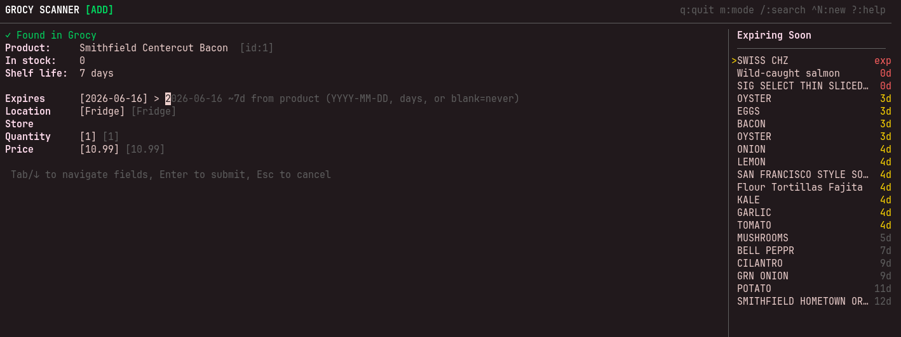
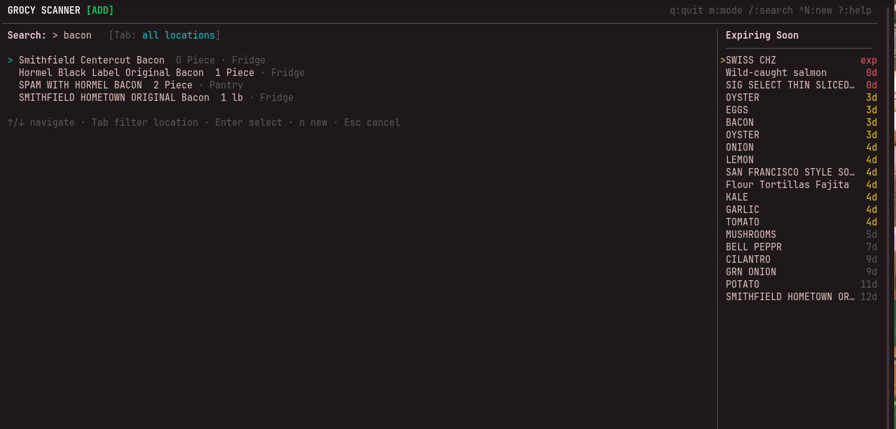

# grocr

A terminal UI for scanning barcodes into [Grocy](https://grocy.info/) inventory. Built with Go and [Bubble Tea](https://github.com/charmbracelet/bubbletea).

## Screenshots

**Add product form** — after a barcode scan, fill in expiry, location, quantity, and price:



**Product search** — press `/` to find products by name:



## Compatibility

Tested against **Grocy 4.6.0**. Other recent versions will likely work, but 4.6.0 is the reference version used during development.

## What it does

Reads UPC barcodes (from a USB scanner or typed manually), looks up product info from Grocy and Open Food Facts, then adds or consumes stock. Products not yet in Grocy are created on the fly with sensible defaults for shelf life and location.

## Features

- **Add / Consume modes** — toggle with `m`
- **Barcode lookup** — checks Grocy first, then Open Food Facts for name, categories, and shelf life
- **Product search** — press `/` to find products by name (useful for items without barcodes, like produce)
- **Edit product name** — press `e` when viewing an existing product
- **Smart defaults** — shelf life estimated from product categories, location remembered per product
- **Scan log** — recent actions shown at the top of the screen

## Installation

Requires Go 1.21 or later.

```
go install github.com/k-leveller/grocr@latest
```

Or build from source:

```
git clone https://github.com/k-leveller/grocr
cd grocr
go build -o grocr .
```

## Configuration

Set environment variables:

```
GROCY_URL=https://your-grocy-instance.example.com
GROCY_API_KEY=your-api-key
```

Or place a JSON file at `~/.config/grocr/config.json`:

```json
{
  "base_url": "https://your-grocy-instance.example.com",
  "api_key": "your-api-key"
}
```

Environment variables take precedence over the config file.

### Optional: display name userfield

If you have a custom Grocy userfield you want to use as a short display label for products (shown in the Expiring Soon panel and as an optional field when creating products), set `display_name_userfield` to the field's key:

```json
{
  "base_url": "https://your-grocy-instance.example.com",
  "api_key": "your-api-key",
  "display_name_userfield": "short_name"
}
```

When set, a **Display name** field appears during product creation, and the configured userfield value is shown in the Expiring Soon panel when available. Leave this unset (or omit it) to disable the feature.

## Usage

```
grocr              # normal mode
grocr --consume    # start in consume mode
grocr --test       # UI preview, no Grocy API calls
```

## Keybindings

| Key | Action |
|-----|--------|
| `q` | Quit |
| `m` | Toggle Add/Consume mode |
| `/` | Search products by name |
| `e` | Edit product name |
| `?` | Help overlay |
| `Tab` / `Shift-Tab` | Navigate form fields |
| `Enter` | Advance field / submit |
| `Esc` | Cancel current scan |
